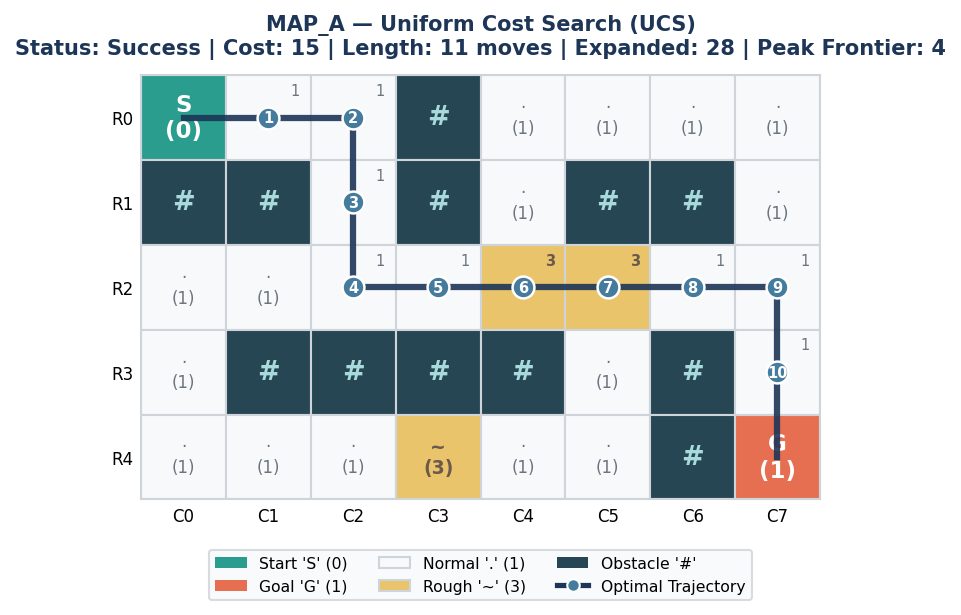
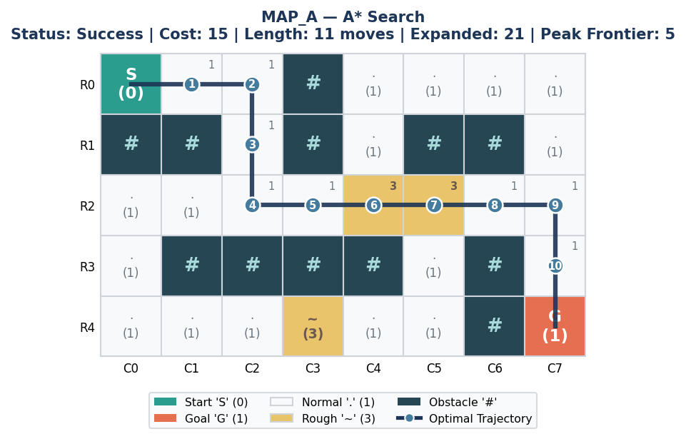
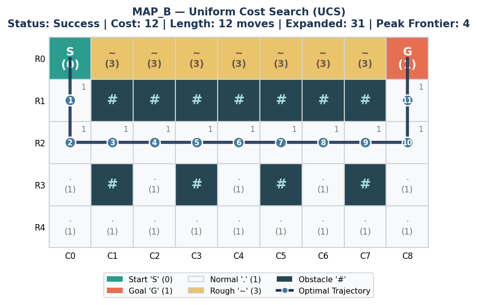
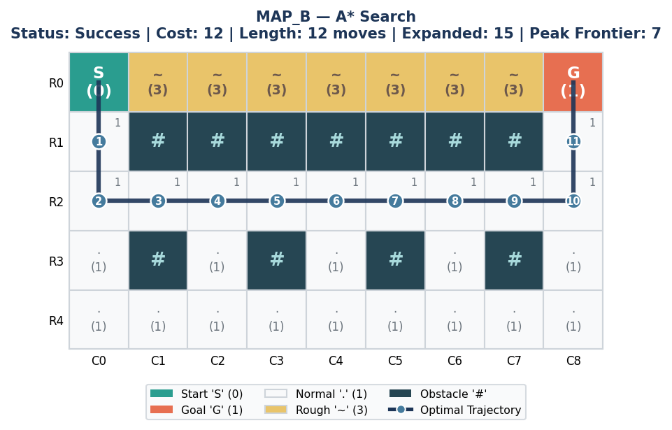
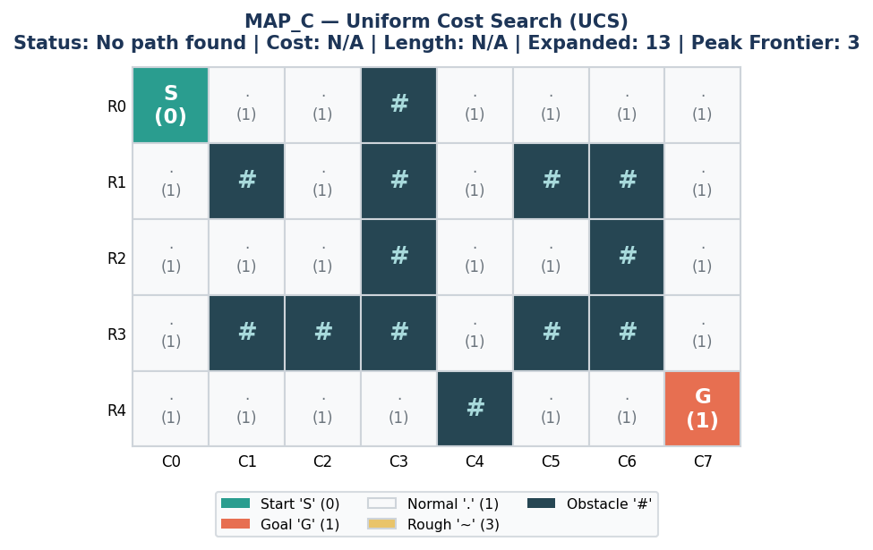
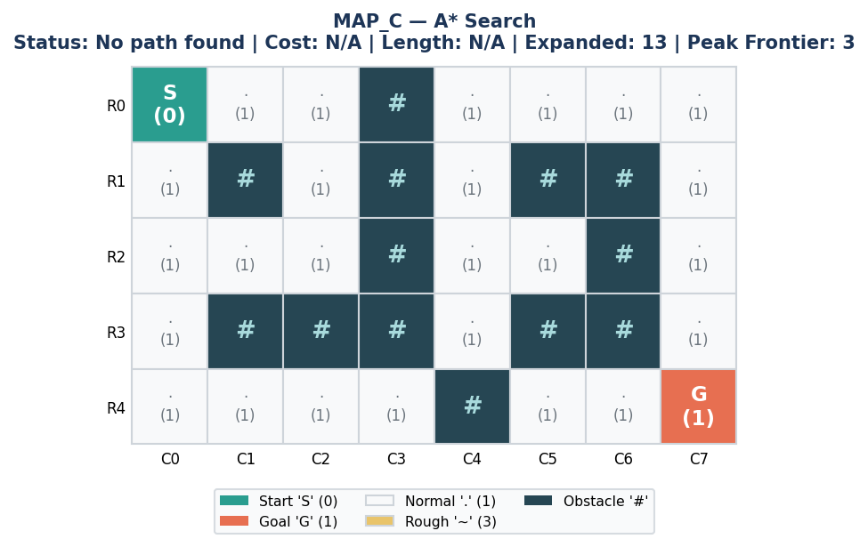
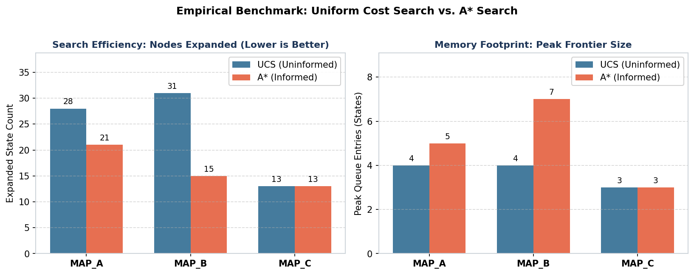

# Autonomous Warehouse Delivery Robot: Discrete Pathfinding Search Algorithms

Implementation, empirical benchmarking, and comparative evaluation of Uniform Cost Search (UCS) and A* Search with the Manhattan distance heuristic for an autonomous mobile robot on weighted warehouse grids.

## Problem Overview

In an automated warehouse fulfillment facility, autonomous mobile robots navigate between loading docks and destination stations across structured grid corridors. Real-world warehouse floors feature obstacles and varying surface conditions that impose non-uniform traversal costs. In such environments, the path with the fewest steps is not necessarily the lowest-cost path.

This project implements graph search algorithms from scratch in Python to compute cost-optimal trajectories, evaluate state space exploration, and analyze algorithmic efficiency across standard benchmark maps.

## Grid and Cost Model

The warehouse is formalized as a discrete 2D grid with 4-connected orthogonal movements: Up $(-1, 0)$, Down $(+1, 0)$, Left $(0, -1)$, and Right $(0, +1)$. Diagonal transitions are prohibited.

| Symbol | Cell Meaning | Transition Cost |
| :--- | :--- | :--- |
| `S` | Start loading dock | 0 (initial position; not counted in traversal cost) |
| `G` | Goal delivery dock | 1 (entering destination cell) |
| `.` | Normal floor tile | 1 (standard concrete surface) |
| `~` | Rough floor patch | 3 (elevated friction / debris zone) |
| `#` | Structural obstacle | Impassable (wall barrier) |

Movement costs are incurred strictly upon **entering** each cell.

## Implemented Algorithms

### 1. Uniform Cost Search (UCS) — Uninformed Search
Uniform Cost Search explores the state space in order of cumulative path cost $g(n)$ from the start state. While standard Breadth-First Search assumes uniform edge costs and measures depth in steps, UCS utilizes a priority queue ordered by $g(n)$. The goal test is performed upon removing a node from the priority queue, guaranteeing a cost-optimal solution for arbitrary positive edge costs ($c \ge 1$).

### 2. A* Search — Informed Search with Manhattan Distance
A* Search guides state exploration toward the goal by evaluating nodes using:
$$f(n) = g(n) + h(n)$$
where $g(n)$ is the exact accumulated cost from the start to node $n$, and $h(n)$ is the estimated remaining cost from node $n$ to the goal.

For 4-directional grid movement, we use the Manhattan distance ($L_1$ norm):
$$h(n) = |r_n - r_G| + |c_n - c_G|$$

Because every reachable cell transition costs at least 1 ($c_{\min} = 1$), Manhattan distance represents a true geometric lower bound on obstacle-free travel. The heuristic is:
- **Admissible:** $h(n) \le h^*(n)$ for all states $n$, ensuring that A* returns an optimal path.
- **Consistent:** $|h(n) - h(n')| \le 1 \le c(n, n')$ for adjacent states $n$ and $n'$, guaranteeing that $f$-values never decrease along a path and nodes do not require reopening once closed.

## Benchmark Results

The table below presents the verified benchmark metrics across all three test maps:

| Map | Algorithm | Status | Path Length (Moves) | Path Cost | Nodes Expanded | Max Frontier Size | Runtime (ms) |
| :--- | :--- | :--- | :---: | :---: | :---: | :---: | :---: |
| **MAP_A** | Uniform Cost Search (UCS) | Success | 11 | 15 | 28 | 4 | 0.235 |
| **MAP_A** | A* Search | Success | 11 | 15 | 21 | 5 | 0.170 |
| **MAP_B** | Uniform Cost Search (UCS) | Success | 12 | 12 | 31 | 4 | 0.081 |
| **MAP_B** | A* Search | Success | 12 | 12 | 15 | 7 | 0.056 |
| **MAP_C** | Uniform Cost Search (UCS) | No path found | N/A | N/A | 13 | 3 | 0.041 |
| **MAP_C** | A* Search | No path found | N/A | N/A | 13 | 3 | 0.099 |

## Visual Results and Path Layouts

### MAP_A: Standard Warehouse Layout (5x8)
`MAP_A` features structural wall pillars and localized rough patches at `(2,4)`, `(2,5)`, and `(4,3)`.

Both algorithms find the optimal 11-move trajectory from `(0,0)` to `(4,7)`. The cost arithmetic is:
$$8 \text{ normal tiles } (\times 1) + 2 \text{ rough tiles } (\times 3) + 1 \text{ goal tile } (\times 1) = 8 + 6 + 1 = 15$$

| Uniform Cost Search (28 Expanded) | A* Search (21 Expanded) |
| :---: | :---: |
|  |  |

*A\* achieves a 25.0% reduction in node expansions (21 vs. 28) by directing exploration toward the goal dock.*

---

### MAP_B: Step Count vs. Traversal Cost Tradeoff (5x9)
`MAP_B` is specifically designed to evaluate whether search algorithms distinguish between shortest distance in moves and lowest total path cost.

```text
S~~~~~~~G
.#######.
.........
.#.#.#.#.
.........
```

#### Route Comparison:
1. **Direct Rough Corridor (Row 0):** Requires only **8 moves**, but crosses 7 rough tiles ($7 \times 3$) plus the goal ($1$), giving a total cost of **22**.
2. **Clean Detour Corridor (Row 2):** Requires **12 moves** around the central wall, but traverses 11 clean tiles ($11 \times 1$) plus the goal ($1$), giving a total cost of **12**.

| Uniform Cost Search (31 Expanded) | A* Search (15 Expanded) |
| :---: | :---: |
|  |  |

*Both algorithms correctly identify that Cost 12 < 22 and choose the 12-move detour. A\* requires 51.6% fewer expansions (15 vs. 31) to verify this optimal path.*

---

### MAP_C: Unsolvable Barrier Map (5x8)
`MAP_C` contains an unbroken wall barrier across Column 3 from Row 0 to Row 3, with the only lower opening at `(4,3)` blocked by a wall at `(4,4)`.

```text
S..#....
.#.#.##.
...#..#.
.###.##.
....#..G
```

| Uniform Cost Search (13 Expanded) | A* Search (13 Expanded) |
| :---: | :---: |
|  |  |

*The start dock is isolated within a 13-cell reachable component. Both algorithms systematically visit all 13 reachable nodes, exhaust their priority queues, and terminate gracefully with the exact status `No path found`.*

---

### Search Performance Comparison



## Comparative Analysis and Discussion

1. **Path Cost Optimality:** Both algorithms return identical, mathematically optimal paths on all solvable maps (Cost 15 on `MAP_A`, Cost 12 on `MAP_B`).
2. **Search Efficiency (Nodes Expanded):** A* expands significantly fewer nodes on solvable layouts (21 vs. 28 on `MAP_A`; 15 vs. 31 on `MAP_B`). The Manhattan heuristic effectively prunes exploratory branches that lead away from the target.
3. **Memory Footprint (Max Frontier Size):** Peak frontier size for A* is slightly larger on solvable maps (5 vs. 4 on `MAP_A`, 7 vs. 4 on `MAP_B`). Because A* prioritizes promising directional neighbors early, it places multiple forward candidates into the queue simultaneously.
4. **Execution Runtime:** On grids of this scale ($5 \times 8$ and $5 \times 9$), runtimes are fractions of a millisecond ($< 0.25\text{ ms}$). Microsecond differences reflect system background load rather than fundamental computational scaling; node expansion count provides the authoritative measure of search effort.

## Algorithm Selection

Based on the empirical benchmark results:
- **A* Search with Manhattan distance** is the recommended choice for this warehouse robot deployment. It guarantees the exact same path cost optimality as UCS while reducing state expansions by 25.0% to 51.6% on solvable layouts.
- In larger warehouse facilities with hundreds or thousands of grid cells, this expansion reduction translates directly to lower computational overhead and faster real-time trajectory replanning.

## Project Structure

```text
.
├── Warehouse_Delivery_Robot_Search_Algorithms.ipynb
├── README.md
├── .gitignore
└── images/
    ├── map_a_ucs.png
    ├── map_a_astar.png
    ├── map_b_ucs.png
    ├── map_b_astar.png
    ├── map_c_ucs.png
    ├── map_c_astar.png
    ├── benchmark_comparison.png
    ├── nodes_expanded_comparison.png
    └── frontier_size_comparison.png
```

## Dependencies

The project uses Python 3.9+ with standard scientific libraries:

```bash
pip install pandas matplotlib numpy jupyter
```

Standard library modules used: `heapq`, `time`, `dataclasses`, `typing`. No third-party pathfinding libraries are used.

## How to Run the Notebook

1. **Clone the repository:**
   ```bash
   git clone https://github.com/shaheenmohammedsh-ops/warehouse-delivery-robot-search-algorithms.git
   cd warehouse-delivery-robot-search-algorithms
   ```

2. **Launch Jupyter:**
   ```bash
   jupyter notebook Warehouse_Delivery_Robot_Search_Algorithms.ipynb
   ```

3. **Execute:**
   Run all cells sequentially (**Kernel -> Restart & Run All**).

4. **Single-Map Testing:**
   To test an individual map independently, modify `GRID = MAP_B` or `GRID = MAP_C` in Section 3 and execute Section 9.1 (Configurable Single-Map Demonstration).

## Open the Full Analysis

The complete code, detailed derivations, assertion checks, summary tables, and interactive demonstrations are available in the authoritative notebook:
- [`Warehouse_Delivery_Robot_Search_Algorithms.ipynb`](Warehouse_Delivery_Robot_Search_Algorithms.ipynb)

## Repository

- **GitHub Repository:** [https://github.com/shaheenmohammedsh-ops/warehouse-delivery-robot-search-algorithms](https://github.com/shaheenmohammedsh-ops/warehouse-delivery-robot-search-algorithms)
